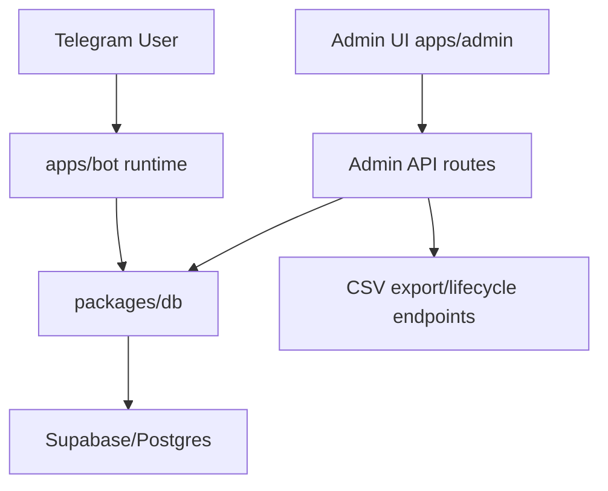
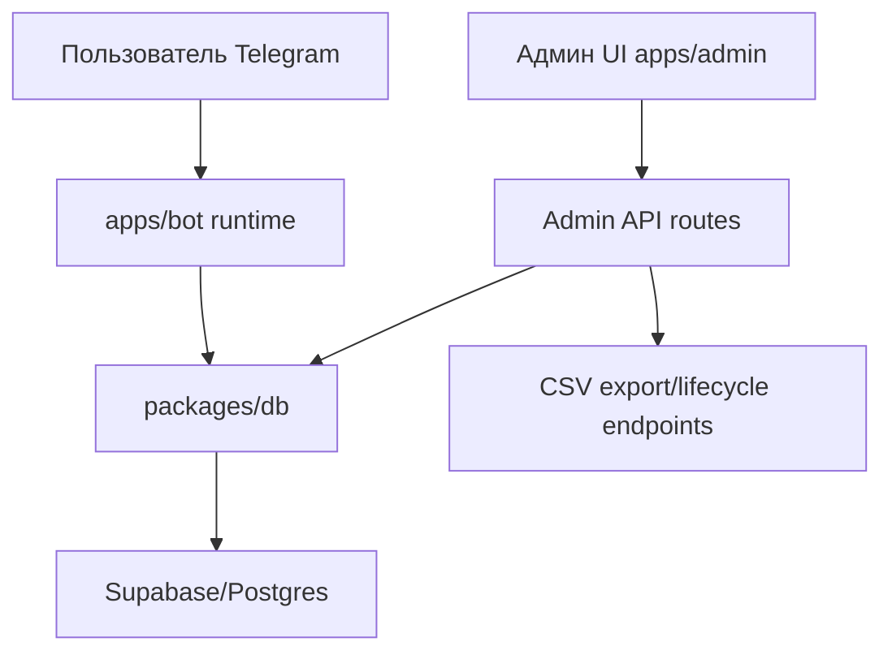

# telegram-event-registration-service

## English

## Problem
Event organizers lose registrations in Telegram chats and need auditable participant data, capacity control, and admin tools.

## Solution
This monorepo implements an event registration service: Telegram bot + admin panel + Supabase data layer with export and lifecycle operations.

## Tech Stack
- Node.js 20+
- TypeScript
- PostgreSQL / Supabase
- Telegram Bot API (`telegraf`)
- Next.js (admin UI)
- Docker Compose

## Architecture
Top-level structure:
```text
apps/
  bot/
  admin/
packages/
  db/
  shared/
supabase/migrations/
api/
docker-compose.yml
```



## Features
- Event registration through Telegram bot
- Data validation in API/domain flows
- Capacity limit with waitlist/promote mechanics
- Admin commands and event lifecycle (`publish`, `close`, `checkin`, `promote`)
- CSV export via admin endpoint

## How to Run
Local:
```bash
nvm install
nvm use
yarn install
cp .env.example .env
yarn dev
```

Quality checks:
```bash
yarn lint
yarn typecheck
yarn test
```

Docker:
```bash
cp .env.example .env
docker compose up --build
```

## Русский

## Проблема
Организаторы мероприятий теряют регистрации в Telegram-чатах и нуждаются в прозрачном учете участников, контроле мест и админ-инструментах.

## Решение
Этот монорепозиторий реализует сервис регистрации на мероприятия: Telegram-бот + админ-панель + слой данных Supabase с экспортом и lifecycle-операциями.

## Стек
- Node.js 20+
- TypeScript
- PostgreSQL / Supabase
- Telegram Bot API (`telegraf`)
- Next.js (админ-интерфейс)
- Docker Compose

## Архитектура
Верхнеуровневая структура:
```text
apps/
  bot/
  admin/
packages/
  db/
  shared/
supabase/migrations/
api/
docker-compose.yml
```



## Возможности
- Регистрация участников через Telegram-бота
- Валидация данных в API и доменной логике
- Ограничение мест с waitlist/promote
- Админ-команды и lifecycle событий (`publish`, `close`, `checkin`, `promote`)
- Экспорт в CSV через admin endpoint

## Как запустить
Локально:
```bash
nvm install
nvm use
yarn install
cp .env.example .env
yarn dev
```

Проверка качества:
```bash
yarn lint
yarn typecheck
yarn test
```

Через Docker:
```bash
cp .env.example .env
docker compose up --build
```
