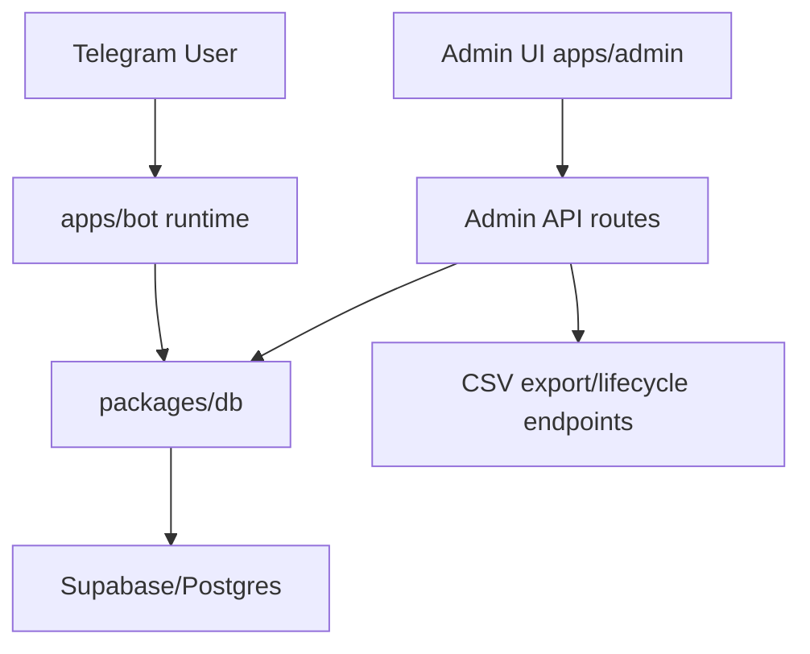
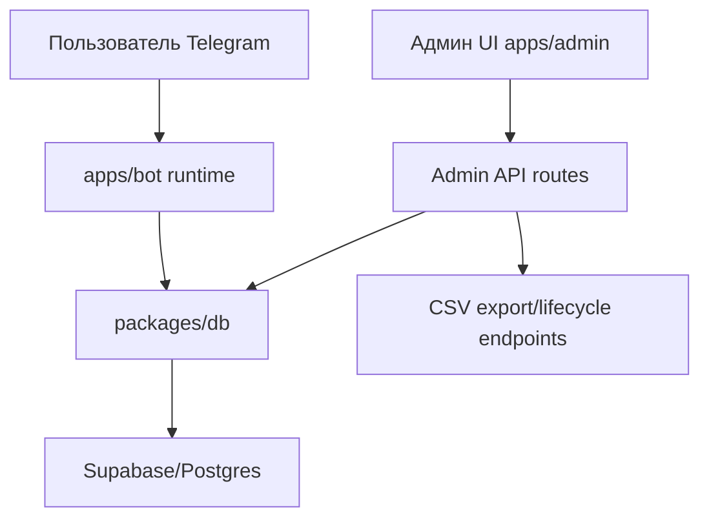

# telegram-event-registration-service
[](https://github.com/DenisArger/telegram-event-registration-service/actions/workflows/ci.yml)


## English

## Problem
Event organizers lose registrations in Telegram chats and need auditable participant data, capacity control, and admin tools.

## Solution
This monorepo implements an event registration service: Telegram bot + admin panel + Supabase data layer with export and lifecycle operations.

## Tech Stack
- Node.js 20+
- TypeScript
- PostgreSQL / Supabase
- Telegram Bot API (`telegraf`)
- Next.js (admin UI)
- Docker Compose

## Architecture
Top-level structure:
```text
apps/
  bot/
  admin/
packages/
  db/
  shared/
supabase/migrations/
api/
docker-compose.yml
```



## Demo
- Demo guide: [`docs/DEMO.md`](docs/DEMO.md)
- Media folder: [`docs/demo-assets/`](docs/demo-assets/)
- Suggested GIF set:
  - `docs/demo-assets/gifs/01-dashboard.gif`
  - `docs/demo-assets/gifs/02-events.gif`
  - `docs/demo-assets/gifs/03-attendees-table.gif`
  - `docs/demo-assets/gifs/04-organizations.gif`
  - `docs/demo-assets/gifs/05-theme-toggle.gif`

## Features
- Event registration through Telegram bot
- Data validation in API/domain flows
- Capacity limit with waitlist/promote mechanics
- Admin commands and event lifecycle (`publish`, `close`, `checkin`, `promote`)
- CSV export via admin endpoint
- Redesigned admin UI (responsive + light/dark theme)

## Quick Start
Local:
```bash
nvm install
nvm use
yarn install
cp .env.example .env
yarn dev
```

Admin-only dev:
```bash
nvm use 20
yarn workspace @event/admin dev
```

Quality checks:
```bash
yarn lint
yarn typecheck
yarn test
```

Admin build check:
```bash
yarn workspace @event/admin build
```

Email admin auth bootstrap:
```bash
# 1) edit supabase/sql/admin_auth_bootstrap.sql
#    set real admin/organizer emails in ops.admin_auth_seed
# 2) run script in Supabase SQL editor
# 3) keep apps/bot/api/admin/auth/email.ts with shouldCreateUser: false
```

Docker:
```bash
cp .env.example .env
docker compose up --build
```

## Русский

## Проблема
Организаторы мероприятий теряют регистрации в Telegram-чатах и нуждаются в прозрачном учете участников, контроле мест и админ-инструментах.

## Решение
Этот монорепозиторий реализует сервис регистрации на мероприятия: Telegram-бот + админ-панель + слой данных Supabase с экспортом и lifecycle-операциями.

## Стек
- Node.js 20+
- TypeScript
- PostgreSQL / Supabase
- Telegram Bot API (`telegraf`)
- Next.js (админ-интерфейс)
- Docker Compose

## Архитектура
Верхнеуровневая структура:
```text
apps/
  bot/
  admin/
packages/
  db/
  shared/
supabase/migrations/
api/
docker-compose.yml
```



## DEMO
- Гайд: [`docs/DEMO.md`](docs/DEMO.md)
- Папка с медиа: [`docs/demo-assets/`](docs/demo-assets/)
- Рекомендуемые GIF:
  - `docs/demo-assets/gifs/01-dashboard.gif`
  - `docs/demo-assets/gifs/02-events.gif`
  - `docs/demo-assets/gifs/03-attendees-table.gif`
  - `docs/demo-assets/gifs/04-organizations.gif`
  - `docs/demo-assets/gifs/05-theme-toggle.gif`

## Возможности
- Регистрация участников через Telegram-бота
- Валидация данных в API и доменной логике
- Ограничение мест с waitlist/promote
- Админ-команды и lifecycle событий (`publish`, `close`, `checkin`, `promote`)
- Экспорт в CSV через admin endpoint
- Обновленный интерфейс админки (адаптив + светлая/темная тема)

## Как запустить
Локально:
```bash
nvm install
nvm use
yarn install
cp .env.example .env
yarn dev
```

Только админка:
```bash
nvm use 20
yarn workspace @event/admin dev
```

Проверка качества:
```bash
yarn lint
yarn typecheck
yarn test
```

Проверка сборки админки:
```bash
yarn workspace @event/admin build
```

Bootstrap email-авторизации для админов:
```bash
# 1) откройте supabase/sql/admin_auth_bootstrap.sql
#    и укажите реальные email админов/организаторов в ops.admin_auth_seed
# 2) выполните скрипт в Supabase SQL editor
# 3) в apps/bot/api/admin/auth/email.ts оставьте shouldCreateUser: false
```

Через Docker:
```bash
cp .env.example .env
docker compose up --build
```
